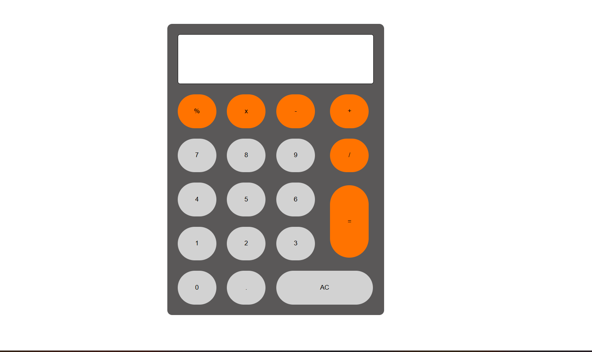

# Calculator App

A simple web-based calculator built with HTML, CSS, and JavaScript for a user-friendly experience.

# Image

## 🛠️ Technologies
- **HTML5**: Structured markup for the calculator interface
- **CSS3**: Responsive styling with Flexbox and media queries
- **JavaScript**: Logic for calculations and user interactions
- **VS Code**: Development environment
- **Git**: Version control for collaboration

## 🚀 Features
- **Basic Arithmetic**: Supports addition, subtraction, multiplication, and division
- **Responsive Interface**: Adapts to mobile and desktop screens using CSS Flexbox
- **Real-Time Calculations**: JavaScript-powered instant result

## 📋 Prerequisites

- Web browser (Chrome, Firefox, Safari, etc.)
- Text editor (VS Code, Sublime, etc.) for development

## 🛠 Installation

1. Clone or download the project.
2. Open calculator.html in a web browser.

No additional dependencies required.

## 📁 Project Structure
```bash
calculator_app/
├── calculator.html # Main HTML file
├── calculator.css # CSS styles
├── calculator.js # JavaScript logic
├── image/Calculator.png # Final product image
└── README.md # Project documentation
````
## 🎨 Styling

- Uses CSS3 for layout and design
- Flexbox for responsive button grid
- Hover effects for interactive feedback

## 🙏 Acknowledgments

- Built with ❤ using HTML, CSS, and JavaScript
- Inspired by simple web development principles
